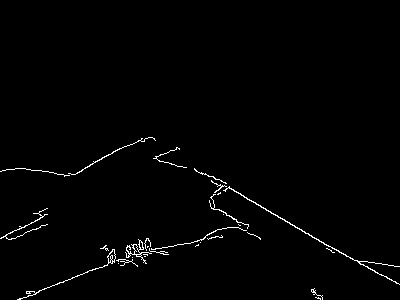

# image-tool
一个图像处理命令行工具。
## 编译指南
### 依赖环境
编译工具：支持 C++11 及以上标准的编译器
构建工具：CMake 3.10 及以上版本
核心库：OpenCV 4.x 版本
### 编译步骤
进入项目根目录:cd /path/to/your/image-tool
创建并进入构建目录:mkdir build && cd build
生成编译配置文件:cmake ..  
执行编译:make  
## 参数说明
基础语法：./image-tool <输入图像路径> <输出图像路径> [处理参数]
<输入图像路径>：待处理图像的完整路径或相对路径
<输出图像路径>：处理后图像的保存路径
[处理参数]：可选，指定需要执行的图像处理操作。
参数包括：--gray、--blur、--canny
--gray操作处理结果图：
--blur操作处理结果图：
--canny操作处理结果图：