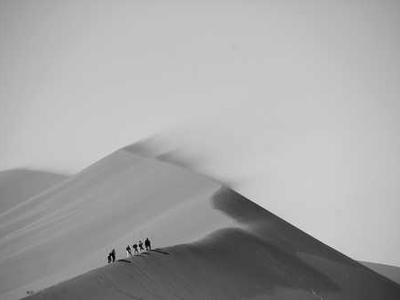

# image-tool
徐国栋
一个图像处理命令行工具。

## 编译指南

### 依赖环境

- **编译工具**：支持 C++11 及以上标准的编译器
- **构建工具**：CMake 3.10 及以上版本  
- **核心库**：OpenCV 4.x 版本

### 编译步骤
1. 进入项目根目录：
   ```bash
   cd /path/to/your/image-tool
   ```

2. 创建并进入构建目录：
   ```bash
   mkdir build && cd build
   ```

3. 生成编译配置文件：
   ```bash
   cmake ..
   ```

4. 执行编译：
   ```bash
   make
   ```

## 参数说明

**基础语法**：
```bash
./image-tool <输入图像路径> <输出图像路径> [处理参数] [角度]
```

**参数详解**：

- **`<输入图像路径>`**：待处理图像的完整路径或相对路径
- **`<输出图像路径>`**：处理后图像的保存路径
- **`[处理参数]`**：可选，指定需要执行的图像处理操作

**可用处理参数**：

| 参数 | 说明 | 示例效果 |
|------|------|----------|
| `--gray` | 灰度化处理 |  |
| `--blur` | 模糊处理 |  |
| `--canny` | 边缘检测 |  |
| `--rotate angle` | 图像旋转（需指定角度） |  |
| `--rotate 90` | 旋转90度 |  |
| `--rotate 180` | 旋转180度 |  |
| `--rotate 270` | 旋转270度 |  |